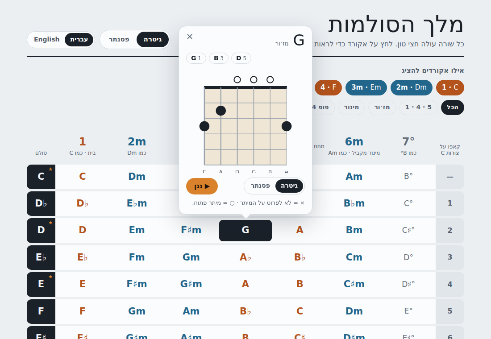

# מלך הסולמות · King of Scales

Learn to play the chords of any major key by their **scale degrees**. Pick the
degrees you care about (say 1 · 4 · 5, which is C F G in C), and the app shows
those chords in all 12 keys, with guitar and piano diagrams you can hear.

> **Live demo:** https://king-of-scales.vercel.app/ (deployed on Vercel; every PR gets a preview deployment)



## Features

- **One table, your columns.** 12 rows (C, D♭, D, E♭, E, F, F♯, G, A♭, A, B♭, B), one column per
  degree in your sequence, out of 1, 2m, 3m, 4, 5, 6m and 7°.
- **Your own sequence.** Type degree numbers (`1-6-4-5`) and the table shows exactly those
  columns in that order, or type chords (`Am F C G`) and they are converted to numbers in their
  key first, chord by chord, with a choice of key when several fit. Common progressions
  (1-5-6-4, 1-6-4-5, 6-4-1-5, 2-5-1, 1-4-5, all) are one tap away.
- **Role names.** Column headers explain the function of each degree: home (1), moving away (4),
  tension / dominant (5), relative minor (6m).
- **Colour by quality.** Major, minor and diminished chords each have their own colour.
- **Open-chord keys and capo.** ★ marks keys that are easy with open chords; the last column
  gives the capo fret for playing the key with C shapes.
- **Chord popover.** Correctly spelled chord tones, a guitar or piano diagram, a play button
  (Web Audio) and a short tip. On phones it becomes a bottom sheet.
- **Hebrew and English.** Hebrew (right to left) by default, English (left to right) one tap away.
  Chord names, the table and the diagrams always read left to right.
- **Light and dark themes**, keyboard accessible (checked with axe, WCAG 2.1 AA), and your
  selection, instrument and language are remembered.

## Install on your phone

The app is a PWA: open https://king-of-scales.vercel.app/ and

- **Android (Chrome):** tap "Install app" when offered, or ⋮ → _Add to Home screen_ / _Install app_
- **iPhone (Safari):** Share → _Add to Home Screen_

Once installed it opens full screen, has its own icon and works offline.

## Stack

Vite · React 18 · TypeScript (strict) · Redux Toolkit · CSS Modules · Vitest + Testing Library ·
ESLint + Prettier · Husky + lint-staged + commitlint · GitHub Actions (CI) · Vercel (hosting) · vite-plugin-pwa (installable, offline)

## Scripts

| Script               | What it does                       |
| -------------------- | ---------------------------------- |
| `npm run dev`        | Start the dev server               |
| `npm run build`      | Typecheck and build for production |
| `npm run preview`    | Serve the production build locally |
| `npm run lint`       | ESLint, zero warnings allowed      |
| `npm run typecheck`  | TypeScript without emitting        |
| `npm test`           | Run the test suite once            |
| `npm run test:watch` | Run tests in watch mode            |
| `npm run format`     | Format everything with Prettier    |

Requires Node 20 (`nvm use`).

## Project structure

```
src/
  app/           App shell
  components/    Header, SegmentedControl, DegreePicker, ChordTable, ChordCell,
                 ChordPopover, GuitarDiagram, PianoDiagram, PlayButton, Legend
  features/ui/   ui slice and localStorage persistence
  i18n/          typed Hebrew and English messages
  lib/music/     framework-free music theory and audio (+ unit tests)
  store/         Redux store
  hooks/         typed Redux hooks, messages, popover positioning
  styles/        design tokens and global styles
```

## How the music logic works

Every major key is built from the same formula. Counting in semitones from the root, the major
scale is `0 2 4 5 7 9 11`, and stacking thirds on each step gives the same chord qualities in every
key:

| Degree  | 1     | 2m    | 3m    | 4     | 5     | 6m    | 7°         |
| ------- | ----- | ----- | ----- | ----- | ----- | ----- | ---------- |
| In C    | C     | Dm    | Em    | F     | G     | Am    | B°         |
| Quality | major | minor | minor | major | major | minor | diminished |

So the table is **generated, not hard-coded**: `lib/music` takes each of the 12 keys, applies the
formula, spells every chord with the right letter names (in F♯ the 7° is E♯°, not F°), and returns
only the columns you selected. All of it is pure TypeScript with unit tests, separate from React.

### Notes on the spec

- The spec's degree chips and presets were later replaced by the sequence box, at the owner's
  request; the table's columns now follow the typed order.
- Clicking the header's instrument switch keeps the popover open, so both switches can be seen
  changing together.

## Next ideas

- Minor keys (natural/harmonic minor) alongside the major-key table
- Seventh chords (maj7, m7, 7, m7♭5) as an optional column set
- Left-handed guitar diagrams
- A practice mode: play a progression and name the chords by ear
- Transpose a song: type chords in one key and read them in another

## License

[MIT](LICENSE) © Neria Okbi
